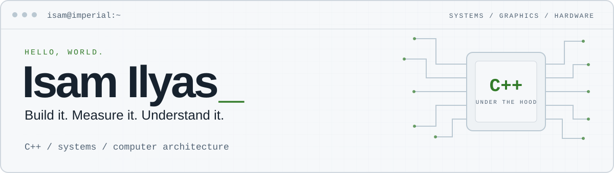

<picture>
  <source media="(prefers-color-scheme: dark)" srcset="assets/header-dark.svg">
  <source media="(prefers-color-scheme: light)" srcset="assets/header-light.svg">
  
</picture>

  <strong>Electronic &amp; Information Engineering · Imperial College London</strong> 
  Seeking Summer 2027 software engineering internships

  <a href="#selected-work">Selected work</a> &nbsp; / &nbsp;
  <a href="#current-focus">Current focus</a> &nbsp; / &nbsp;
  <a href="#beyond-the-terminal">Beyond the terminal</a>

  <a href="mailto:isam.ilyas24@imperial.ac.uk">
    <picture>
      <source media="(prefers-color-scheme: dark)" srcset="assets/contact-email-dark.svg">
      <source media="(prefers-color-scheme: light)" srcset="assets/contact-email-light.svg">
      
    </picture>
  </a>
  &nbsp;
  <a href="https://www.linkedin.com/in/isamilyas/">
    <picture>
      <source media="(prefers-color-scheme: dark)" srcset="assets/contact-linkedin-dark.svg">
      <source media="(prefers-color-scheme: light)" srcset="assets/contact-linkedin-light.svg">
      
    </picture>
  </a>

---

I like understanding what sits underneath an abstraction: how a numerical expression becomes instructions, how a renderer turns matrices into pixels, and how software talks to hardware.

My projects span **C++ execution engines, graphics and embedded software**. I’m especially interested in where software design meets hardware behaviour.

## Selected work

<table>
<tr>
<td width="50%" valign="top">

<h3>01 / FastStreamCompute</h3>

<strong>Compiling maths down to the metal.</strong>

A C++20 numerical execution engine that compiles expression graphs into custom register bytecode for SIMD-vectorised, chunked batch evaluation. Execution is optimised through cache-aligned memory layouts, graph rewrites, opcode fusion and persistent concurrent workers.

<strong>Measured:</strong> Throughput of <strong>1.66 billion records/s</strong> across 6 workers; a <strong>7.9× execution speedup</strong> and an <strong>86% instruction reduction</strong>, verified using Linux perf and hardware performance counters.

Workload-specific results; benchmark context and limitations are documented in the repository.

<code>C++20</code> <code>CMake</code> <code>Google Benchmark</code> <code>perf</code>

<a href="https://github.com/Isam-Ilyas29/FastStreamCompute"><strong>Explore the engine →</strong></a>

</td>
<td width="50%" valign="top">

<h3>02 / Game Engine</h3>

<strong>Controlling pixels. From vertex to viewport.</strong>

A cross-platform C++/OpenGL engine with shader and texture loading, 3D camera controls, transformations, post-processing and a docked editor.

A 3D Snake demo brings together rendering, input and camera systems on Windows and Linux.

<code>C++17</code> <code>OpenGL</code> <code>CMake</code>

<a href="https://github.com/Isam-Ilyas29/Game-Engine"><strong>Explore the engine →</strong></a> &nbsp; · &nbsp; <a href="https://github.com/Isam-Ilyas29/Game-Engine#demo-3d-snake">See the demo</a>

</td>
</tr>
<tr>
<td width="50%" valign="top">

<h3>03 / Game Boy Game</h3>

A Game Boy game written in assembly, with tile and sprite mapping, VRAM banking, OAM sprite handling, DMA transfers, hardware timers and joypad input synchronised with VBlank interrupts.

<code>Assembly</code>

<a href="https://github.com/Isam-Ilyas29/Gameboy-Game"><strong>Explore the game →</strong></a>

</td>
<td width="50%" valign="top">

<h3>04 / ST7735 Display Driver</h3>

Display-driver work in C for STM32, covering SPI communication with an ST7735 LCD, display configuration and RGB565 colour.

<code>C</code> <code>STM32</code> <code>SPI</code> <code>Hardware</code>

<a href="https://github.com/Isam-Ilyas29/ST7735-Drivers"><strong>Read the driver →</strong></a>

</td>
</tr>
</table>

## Current focus

<picture>
  <source media="(max-width: 640px) and (prefers-color-scheme: dark)" srcset="assets/focus-mobile-dark.svg">
  <source media="(max-width: 640px) and (prefers-color-scheme: light)" srcset="assets/focus-mobile-light.svg">
  <source media="(prefers-color-scheme: dark)" srcset="assets/focus-dark.svg">
  <source media="(prefers-color-scheme: light)" srcset="assets/focus-light.svg">
  
</picture>

## Beyond the terminal

  <picture>
    <source media="(prefers-color-scheme: dark)" srcset="assets/hobby-triathlon-dark.svg">
    <source media="(prefers-color-scheme: light)" srcset="assets/hobby-triathlon-light.svg">
    
  </picture>
  <picture>
    <source media="(prefers-color-scheme: dark)" srcset="assets/hobby-scuba-dark.svg">
    <source media="(prefers-color-scheme: light)" srcset="assets/hobby-scuba-light.svg">
    
  </picture>
  <picture>
    <source media="(prefers-color-scheme: dark)" srcset="assets/hobby-cricket-dark.svg">
    <source media="(prefers-color-scheme: light)" srcset="assets/hobby-cricket-light.svg">
    
  </picture>
  <picture>
    <source media="(prefers-color-scheme: dark)" srcset="assets/hobby-photography-dark.svg">
    <source media="(prefers-color-scheme: light)" srcset="assets/hobby-photography-light.svg">
    
  </picture>

---

  Build something interesting. Find out how it works. Make it better.

